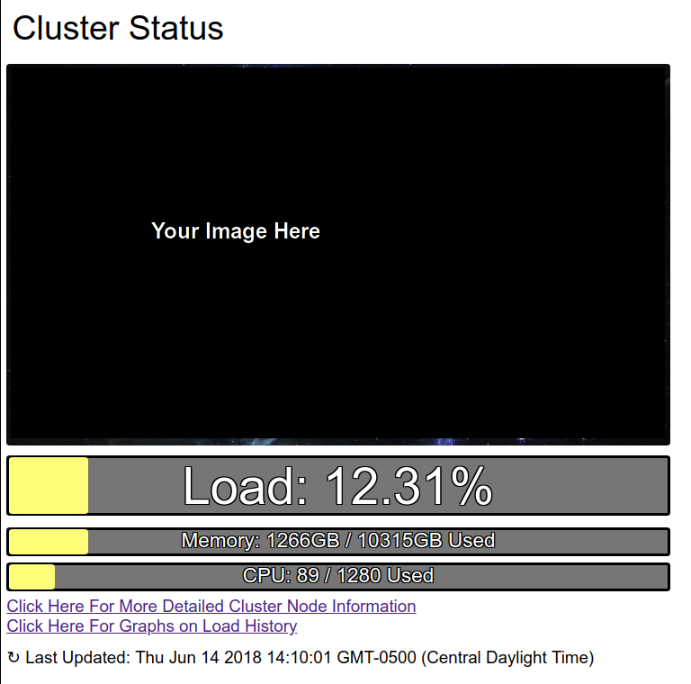
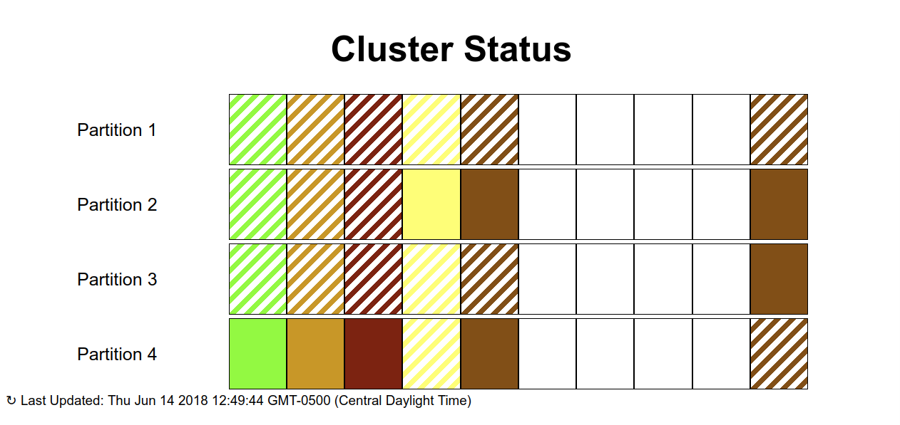
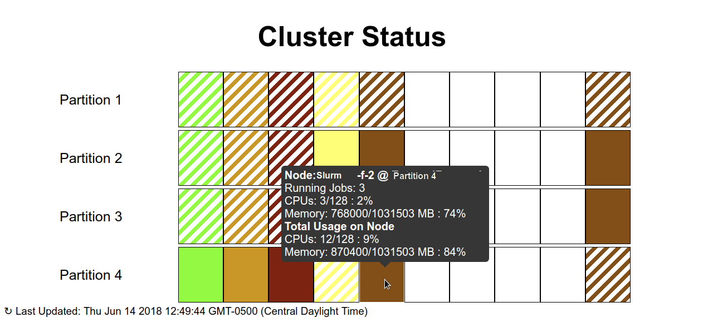
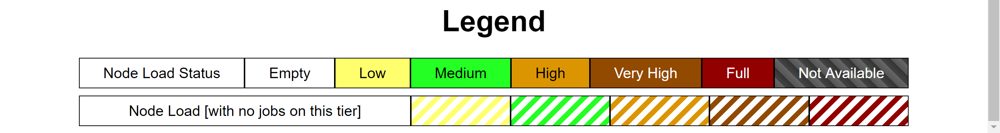
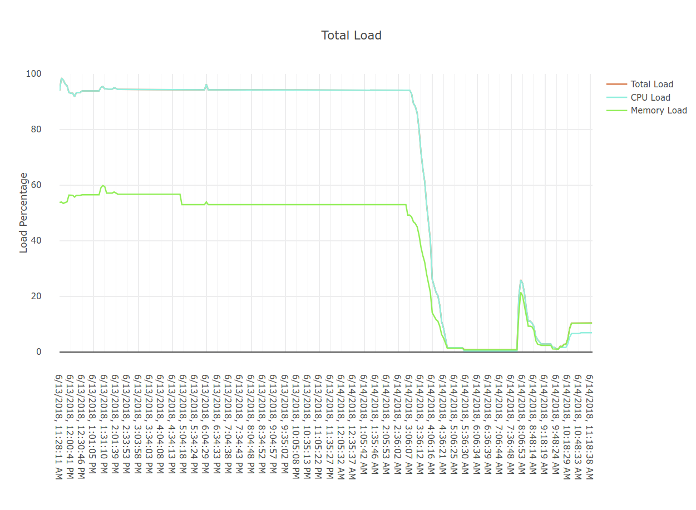
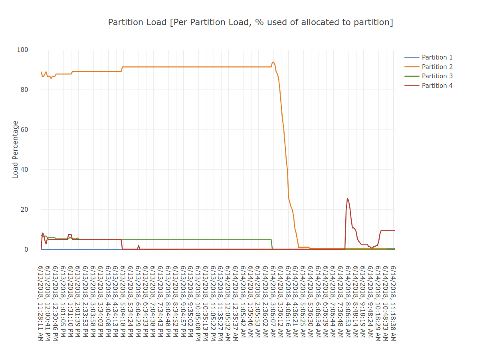

### Slurm RestAPI Front End

This repo has the html files for the front end of slurm-rest-api.

These are only a few examples of what could be done with the api.

When using these files, make sure to modify the JSON url to match the routes on your instance of slurm-rest-api. Search `slurm-rest-api` in the files to find them quickly.

#### Current Load Page

#### Node Status Page

Hovering over a node/priority with jobs running on it

Legend

#### Graphs Page

Interactive graphs powered by plotly.js

## Legal ##

Copyright Government of Canada 2018

Written by: National Microbiology Laboratory, Public Health Agency of Canada

Licensed under the Apache License, Version 2.0 (the "License"); you may not use
this work except in compliance with the License. You may obtain a copy of the
License at:

http://www.apache.org/licenses/LICENSE-2.0

Unless required by applicable law or agreed to in writing, software distributed
under the License is distributed on an "AS IS" BASIS, WITHOUT WARRANTIES OR
CONDITIONS OF ANY KIND, either express or implied. See the License for the
specific language governing permissions and limitations under the License.

## Contact ##

**Jeffrey Thiessen**: jeffrey.thiessen@canada.ca

**Gary van Domselaar**: gary.vandomselaar@canada.ca
